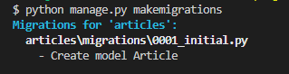
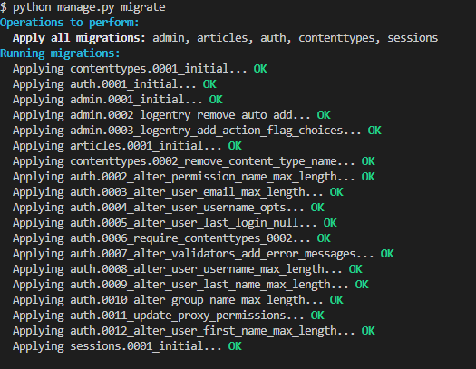

## <mark>Web FrameWork</mark>

**Django 설치**

`pip install django==3.2.18` 

**Django Project**

* 프로젝트 생성
  
  `django-admin startproject firstpjt`
  
  

* 서버 실행
  
  `python manage.py runserver`
  
  
  
  * 현재 파일의 위치를 확인해야됨 

        

**가상환경**

* 가상환경 생성
  
  `python -m venv venv`
  
  

* 가상환경 활성화(ON)
  
  `source venv/Scripts/activate`
  
  
  
  * 가상환경 비활성화(OFF)
    
    `deactivate`

* django 설치
  
  `pip install django==3.2.18`

**프로젝트와 앱**

* Django Application 애플리케이션 생성
  
  `python manage.py startapp articles` 복수형 권장
  
  

* 애플리케이션 등록
  
  `settings.py`
  
  

        앱을 사용하기 위해서는 INSTALLED_APPS 리스트에 반드시 추가해야 함

**요청과 응답**

> URL  → VIEW → TEMPLATE

* URLs (요청)

```python
# urls.py

from django.contrib import admin
from django.urls import path
from articles import views

urlpatterns = [
    path('admin/', admin.site.urls),
    path('articles/', views.index),
    # / 붙여줘야 함!!
]
```

* View(응답)

```python
# views.py

from django.shortcuts import render
from django.http import HttpResponse

# Create your views here.
def index(request):
    return HttpResponse("<h1>나의 첫 Django PJT</h1>")
```


서버 실행 후 → `127.0.0.1:8000/articles`

> html을 작성하는데 너무 불편함

* Templates (실제 내용)
  
  * app 폴더 안에 templates 생성
  
  * templates 폴더 안에 app_name 생성
  
  * `app_name/templates/app_name`
  
  * `index.html` 파일 생성
    
    

```html
<!DOCTYPE html>
<html lang="en">
  <head>
    <meta charset="UTF-8" />
    <meta http-equiv="X-UA-Compatible" content="IE=edge" />
    <meta name="viewport" content="width=device-width, initial-scale=1.0" />
    <title>Document</title>
  </head>
  <body>
    <h1>templates</h1>
  </body>
</html>
```

* View (응답) > templates의 `index.html`에 연결

```python
# views.py

from django.shortcuts import render

def index(request):
    return render(request, 'articles/index.html')
```

* `articles/index.html` 파일의 경로 알려주기

* `render()`
  
  * `render(request, template_name, context)`
  
  * 응답, 경로, 데이터(응답 생성, 템플릿 경로, 템플릿에 사용할 데이터(딕셔너리 타입)


**코드 작성 순서**

> **URL → View → Template**

**데이터의 흐름 순서**


## <mark>Django Template</mark>

**DTL Syntax(예시만)**

1. Variable
   
   ```python
   # urls.py
   
   urlpatterns = [
       path('index/', views.index)
       path('greeting/', views.greeting)    
   ]
   ```
   
   ```python
   # articles/views.py
   
   def greeting(request):
       foods = ['apple', 'banana', 'coconut',]
       info = {
           'name': 'Alice',
       }
       context = {
           'foods': foods,
           'info': info,
       }
       return render(request, 'greeting.html', context)
   ```
   
   ```html
   <!-- articles/templates/articles/greeting.html-->
   <!DOCTYPE html>
   <html lang="en">
     <head>
       <meta charset="UTF-8" />
       <meta http-equiv="X-UA-Compatible" content="IE=edge" />
       <meta name="viewport" content="width=device-width, initial-scale=1.0" />
       <title>Document</title>
     </head>
     <body>
       <p>안녕하세요 저는 {{ info.name }}</p>
       <p>저는 {{ foods.0 }}을 가장 좋아합니다.</p>
   
       <a href="/index"></a>
     </body>
   </html>
   ```

2. Filters

3. Tags
   
   ``
   
   ``

4. for
   
   ```html
   <!-- html 작성법 -->
   <!DOCTYPE html>
   <html lang="en">
     <head>
       <meta charset="UTF-8" />
       <meta http-equiv="X-UA-Compatible" content="IE=edge" />
       <meta name="viewport" content="width=device-width, initial-scale=1.0" />
       <title>Document</title>
     </head>
     <body>
       <p>메뉴판</p>
       <ul>
       
           <li>{{ food }}</li>
       {% endfor }    
       </ul>
     </body>
   </html>
   ```

5. Comments

    `{# comment #}`

#### Template inheritance

* `articles/templates/articles` 에 `base.html` 생성하기
  
  ```html
  <!DOCTYPE html>
  <html lang="en">
    <head>
      <meta charset="UTF-8" />
      <meta http-equiv="X-UA-Compatible" content="IE=edge" />
      <meta name="viewport" content="width=device-width, initial-scale=1.0" />
      <title>Document</title>
    </head>
    <body>
      <!-- 블럭 만들기 -->
      
      
    </body>
  </html>
  ```

* `index.html` 에서 `base.html` 상속받기
  
  ```html
   
  
   <h1>여기는 index</h1>
  
  ```

* Template 처리(django 는 Template 처리하는 방법)
  
  `settings.py`
  
  `'APP_DIRS': True`

        

* `base.html` 을 프로젝트 상단에 두기 > Django야 템플릿은 여기에 있다

        

* 모든 앱에서 `templates`를 가져다 쓰려면
  
  `setting.py`
  
  `'DIRS' : [BASE_DIR / 'templates']`
  
  

* 사용하기
  
  ```html
   
  <h1>여기는 index</h1>
  
  ```
  
  `` 경로 변경


#### Variable routing

**작성법**

* `urls.py`
  
  ```python
  # urls.py
  
  urlpatterns = [
      path('hello/<str:name>/', views.hello),
      path('hello/<name>/', views.hello),
  ]
  ```

* `articles/views.py`
  
  ```python
  def hello(request, name):
      context = {
          'name' : name,
      }
      return render(request, 'articles/hello.html', context)
  ```

* `templates/articles/hello.html`
  
  ```html
  
  
      <h1>안녕 {{ name }}</h1>
  
  ```

        

#### App URL mapping

* `urls.py` 쪼개기

* `articles/urls.py` 만들기

        

* `firstpjt/urls.py`에 다른 URLconf 모듈을 포함(include)
  
  ```python
  from django.urls import path, include
  
  urlpatterns = [
      # path('admin/', admin.site.urls),
      path('articles/', include('articles.urls')),
  ]
  ```

```
* `articles.urls.py`

```python
from django.urls import path
from . import views

urlpatterns = [
    path('articles/', views.index),
    path('hello/<name>/', views.hello),

]
```

* URL namespace(고유한 URL 사용하기)

* `app_name` attribute 작성하여 URL namespace 설정
  
  ```python
  # articles/urls.py
  app_name = 'articles'
  urlpatterns = [
  
  ]
  ```

* URL tag 변화
  
  `` 에서 ``

## <mark> Model</mark>

#### Form

1. `throw` 작성

**HTML <form> element 작성**

* `articles/urls.py` 에 `url` 추가
  
  ```python
  urlpatterns = [
      path('throw/', views.throw),
  ]
  ```

* `articles/views.py`에 `throw` 추가
  
  ```python
  # articles/views.py
  def throw(request):
      return render(request, 'throw.html')
  ```

* `templates/articles/throw.html` 생성 `base.html`에서 상속 받기
  
  ```html
   
  <h1>Throw</h1>
  <form action="#" method="#"></form>
  
  ```

    

**HTML <input> element**작성

* `throw.html` 에 <form> 추가하기
  
  ```html
   
  <h1>Throw</h1>
  <form action="#" method="GET">
    <label for="message">Throw</label>
    <input type="text" id="message" name="message" />
    <input type="submit" />
  </form>
  
  ```

```
* 서버로부터 정보를 조회하기 위해 `GET` 사용 (대문자)


2. `catch` 작성

**Retrieving the data(Server)**

* `articles/urls.py` 추가하기

```python
urlpatterns = [
    path('catch/', views.catch),
]
```

* `articles/views.py` 추가하기
  
  ```python
  def catch(request):
      return render(request, 'articles/catch.html')
  ```

* `templates/articles/catch.html` 생성 `base.html` 에서 상속
  
  ```html
   
  <h1>Catch</h1>
  <h2>여기서 데이터를 받았어!</h2>
  <a href="/articles/throw/">다시 던지러 가자</a>
  
  ```

* `/articles/thorw/` 슬래시 주의!

* articles 가 너무 많이 반복 되니까

        

        

* `articles`를 받고 `path articles` 자리는 공백으로 

**action 작성**

* `throw` 페이지에서 `form`의 `action` 부분에 링크 넣어주기

* 일단 `catch`를 넣어보자
  
  ```html
   
  <h1>Throw</h1>
  <form action="catch" method="GET">
    <label for="message">Throw</label>
    <input type="text" id="message" name="message" />
    <input type="submit" />
  </form>
  
  ```
- request 사용하기
  
  ```python
  def catch(request):
   message = request.GET.get('message')
   context = {
   'message' : message,
   }
   return render(request, 'articles/catch.html', context)
  ```
  
  ```python
  <!-- articles/templates/catch.html-->
  
  
    <h1>Catch</h1>
    <h2>여기서 {{ message }}를 받았어!!</h2>
    <a href="/throw/">다시 던지러 가자</a>
  
  ```

### Model

1. Model 작성하기
   
   - 새 프로젝트(crud), 앱(articles) 작성 및 앱 등록 `django-admin startproject crud .`  `python manage.py startapp articles`
     
     ```python
     # settings.py
     INSTALLED_APPS = [
     'articles',
     ]
     ```
- `models.py` 작성
  
  - 데이터베이스 테이블의 스키마를 정의하는 것 (모델 클래스 == 테이블 스키마)
    
    ```python
    # articles/models.py
    class Article(models.Model):
        title = models.CharField(max_length=10) # 최대 10글자
        content = models.TextField()  # 글자수 제한 없음
    ```
  
  - id 컬럼은 테이블 생성시 Django가 자동으로 생성
  
  - `CharField(max_length=None, **options)` 데이터 베이스와 Django의 유효성 검사(값을 검증하는 것)에서 활용됨
  
  - `TextField(**options)` 유효성 검증 X
* *model에서도 가상환경을 설정해줘야 하나?*

**Migrations**

> Django가 모델에 생긴 변화를 실제 DB에 반영하는 방법

1. `makemigrations`
   
   - 모델의 변경사항에 대한 새로운 migration을 만들 때 사용 `python manage.py makemigrations`
     
     
     
     ```
     $ python manage.py makemigrations
     Migrations for 'articles':
       articles\migrations\0001_initial.py
         - Create model Article
     ```

2. `migrate`
   
   - 실제 데이터 베이스에 반영하는 과정 (모델의 변경사항과 데이터베이스를 동기화) `python manage.py migrate`
     
     
     
     ```
     Operations to perform:
       Apply all migrations: admin, articles, auth, contenttypes, sessions
     Running migrations:
       Applying contenttypes.0001_initial... OK
       Applying auth.0001_initial... OK
       Applying admin.0001_initial... OK
       Applying admin.0002_logentry_remove_auto_add... OK
       Applying admin.0003_logentry_add_action_flag_choices... OK
       Applying articles.0001_initial... OK
       Applying contenttypes.0002_remove_content_type_name... OK
       Applying auth.0002_alter_permission_name_max_length... OK
       Applying auth.0003_alter_user_email_max_length... OK
       Applying auth.0004_alter_user_username_opts... OK
       Applying auth.0005_alter_user_last_login_null... OK
       Applying auth.0006_require_contenttypes_0002... OK
       Applying auth.0007_alter_validators_add_error_messages... OK
       Applying auth.0008_alter_user_username_max_length... OK
       Applying auth.0009_alter_user_last_name_max_length... OK
       Applying auth.0010_alter_group_name_max_length... OK
       Applying auth.0011_update_proxy_permissions... OK
       Applying auth.0012_alter_user_first_name_max_length... OK
       Applying sessions.0001_initial... OK
     ```

**migration 3단계**

1. `models.py`에 변경사항이 발생하면
2. `migration` 생성 `makemigrations`
3. DB 반영 (모델과 DB의 동기화) `migrate` -> 이 설계도를 해석하는 것이 **<mark>ORM</mark>**

#### ORM

> Object-Relational-Mapping
> 
> 객체 지향 프로그래밍 언어를 사용하여 호환되지 않는 유형의 시스템 간에 (Django ↔ DB)데이터를 변환하는 프로그래밍 기술

**QuerySet API**

**사전준비**

* vscode SQLite 확장 프로그램을 통해 직접 테이블 데이터 확인하기
  
  1. SQLite 설치
  
  2. 실행(DB 우클릭-Open Database)
  
  3. SQLITE EXPLORER 확인 
  
  4. show table

* 외부 라이브러리 설치 및 설정
  
  1. `pip install ipython`
  
  2. `pip install django-extenstions`
  
  3. ```python
     # settings.py
     INSTALLED_APPS = [
         'articles',
         'django_extensions',
     ]
     ```

* 패키지 목록 업데이트
  
  `pip freeze > requirements.txt`

**Django shell**

* `python manage.py shell`

* `python manage.py shell_plus`   django-extions이 제공하는 더 강력한 shell_plus

* 실행
  
  `python manage.py shell_plus`
  
  Django shell 실행
  
  ```
  # Shell Plus Django Imports
  from django.core.cache import cache
  from django.conf import settings
  from django.contrib.auth import get_user_model
  from django.db import transaction
  from django.db.models import Avg, Case, Count, F, Max, Min, Prefetch, Q, Sum, When
  from django.utils import timezone
  from django.urls import reverse
  from django.db.models import Exists, OuterRef, Subquery
  Python 3.9.13 (tags/v3.9.13:6de2ca5, May 17 2022, 16:36:42) [MSC v.1929 64 bit (AMD64)]
  Type 'copyright', 'credits' or 'license' for more information
  IPython 8.8.0 -- An enhanced Interactive Python. Type '?' for help.
  
  In [1]: 
  ```
  
  **ORM 명령어 사용하기**
  
  `Article.objects.all()`
  
  ```
  In[1]: Article.objects.all()
  Qut[1]: <QuerySet []>
  ```

**QuerySet API**

* Database API 구문
  
  `Article.objects.all()`

* CRUD(Create/Reda/Update/Delete)

### CREATE

* 데이터 객체를 만드는(생성하는) 3가지 방법
  
  1. 첫번째
     
     * `article = Article()`
     
     * `article.title`
     
     * `article.save()`
       
       ```python
       # 1 데이터 추가
       >>> article = Article()
       >>> article
       <Article: Article object (None)>
       
       >>> article.title = 'first'
       >>> article.content = 'django!'
       
       >>> article
       <Article: Article object (None)>
       
       
       >>> Article.objects.all()
       <QuerySet []>
       
       
       # 2 저장
       >>> article.save()
       >>> article
       <Article: Article object (1)>
       >>> article.id
       1
       >>> article.pk
       1
       >>> Article.objects.all()
       <QuerySet [Article: Article object (1)]
       
       # 3 변수 접근
       >>> article.title
       'first'
       >>> article.content
       'django!'
       >>> article.created_at
       datetime.datetime(2022, 8, 2, 43, 56, 49345, tzinfo=<UTC>)
       ```
2. 두번째
   
   ```python
   >>> article = Article(title='second', content='django!')
   
   # 아직 저장 전
   >>> article
   <Article: Article object (None)>
   
   # save 호출해서 저장
   >>> article.save()
   >>> article
   <Article: Article object (2)>
   >>> Article.objects.all()
   <QuerySet [<Article: Article object (1)>, <Article: Article object (2)>]
   
   # 값 확인
   >>> article.pk
   2
   >>> article.title
   'second'
   >>> article.content
   'django!'
   ```

3. 세번째(create 메서드 사용)
   
   ```python
   # 생성된 데이터가 바로 반
   >>> Article.objects.create(title='third', content='django!')
   <Article: Article object (3)>
   ```

### READ

* QuerySet return

* 전체 데이터 조회 `all()`
  
  ```python
  >>> Article.objects.all()
  <QuerySet [<Article: Article object (1)>, <Article object (2)>, <Article: Article object(3)>]>
  ```

* 단일 데이터 조회 `get()`
  
  고유성(uniqueness)을 보장하는 조회에서 사용해야함
  
  ```python
  >>> Article.objects.get(pk=1)
  <Article: Article object (1)>
  
  # 객체 찾을 수 없음
  >>> Article.objects.get(pk=100)
  DoesNotExist: Article matching query does not exist. 
  
  >>> Article.objects.get(content='django!')
  MultipleObjectsReturned: get() returned more than one Article -- it returned 2!
  ```

* 지정된 조회 매개 변수와 일치하는 객체를 포함하는 새 QuerySet을 반환 `filter()`
  
  ```python
  >>> Article.objects.filter(content='django!')
  <QuerySet [<Article: Article object (1)>, <Article object (2)>, <Article: Article object(3)>]>
  
  
  >>> Article.objects.filter(title='ssafy')
  <QuerySet []>
  
  >>> Article.objects.filter(title='first')
  <QuerySet [<Article: Article object (1)>]>
  ```


#### Update

```python
>>> article = Article.objects.get(pk=1)

# 인스턴스 변수를 변경
>>> article.title = 'byebye'

# 정상적으로 변경된 것을 확인
```


#### Delete

```python
>>> article = Article.objects.get(pk=1)

# delete 메서드 호출
>>> article.delete()
(1, {'articles.Article': 1})


# 1번 데이터는 조회 불가
>>> Article.objects.get(pk=1)
DoesNotExist: Article matching query does not exist.
```
